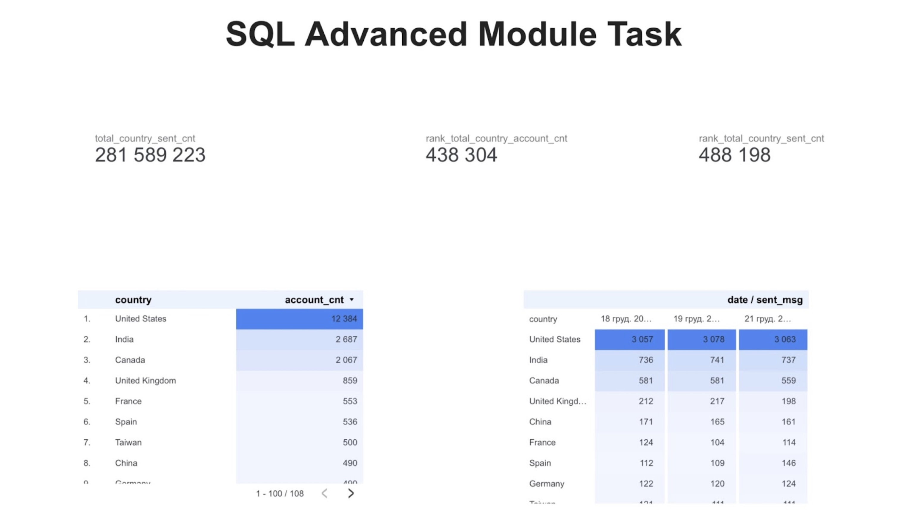

# 📊 Email Campaign Analysis (SQL Project)

## 🔍 Overview
This project analyzes email campaign performance using advanced SQL techniques.
The goal was to understand user engagement and identify top-performing countries.

## 🛠 Tools
	- SQL (JOIN, CTE, Window Functions, DENSE_RANK)

## 📈 What I did
	- Combined multiple tables (accounts, sessions, emails)
	- Calculated key metrics: sent, open, visit
	- Aggregated data by country
	- Ranked countries using window functions
	- Selected top 10 countries by performance

 ## 💡 Key Insights
	- Top countries show significantly higher engagement
	- Verified users interact more with campaigns
	- Email performance varies across regions

## 📊 Dashboard

